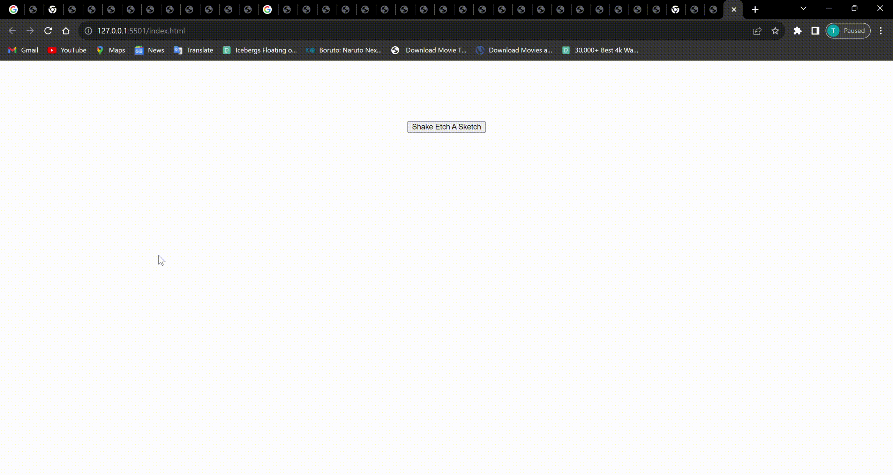

# Etch-a-Sketch
<<<<<<< HEAD

=======
>>>>>>> dcbdc5a (edit readme)
## Description

This is an Etch-A-Sketch project created as part of The Odin Project's curriculum. The Etch-A-Sketch is a classic drawing toy implemented using HTML, CSS, and JavaScript. The project aims to reinforce your understanding of user interactions, event handling, and DOM manipulation.

<<<<<<< HEAD

=======

>>>>>>> dcbdc5a (edit readme)

## Features

- **Drawing Surface**: Provides a grid where users can draw using their mouse cursor.

## Usage

1. Open `index.html` in a web browser.
2. Hover your mouse cursor over the grid to draw.

## Technologies Used

- HTML
- CSS
- JavaScript

## Future Enhancements

While this project covers the functionality of an Etch-A-Sketch, some features to be implemented in the future include:
- Color Selection: Allows users to pick different colors for drawing.
- Clear Functionality: for users to be able to clear the drawing surface to start anew.
- Adding more advanced drawing tools like different brush sizes.
- Implementing the ability to save and load drawings.
- Enhancing the user interface and visual design.
